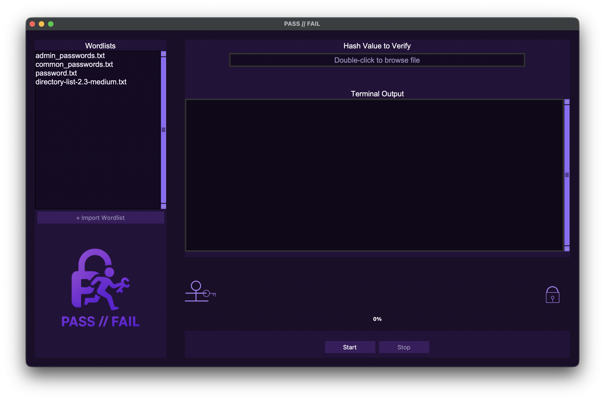

# PASS // FAIL - Hash Verification Tool

🎨 **Hash verification tool with animated progress display**

An intuitive, visual GUI application for testing password security through hash verification. Watch a stick figure animation as your hashes are checked against password dictionaries!

## ✨ Features

- 🎨 **Purple Theme** - Professional, modern interface design
- 🏃‍♂️ **Animated Progress** - Stick figure carries a key to unlock a padlock
- 📂 **Easy File Handling** - Drag & drop support for both hashes and wordlists
- 💬 **Live Updates** - Real-time terminal output shows exactly what's happening
- ⌨️ **Keyboard Shortcuts** - Press Enter to start/stop verification
- 🖥️ **Cross-Platform** - Works on macOS, Windows, and Linux

## 📸 Screenshots

### Main Interface


*Clean, modern interface with drag & drop support and animated progress indicators*

## 📥 Download & Install

### 🚀 **Ready-to-Use Applications** (Recommended)

**👉 [Go to Releases Page](https://github.com/mmark5466-dev/pass_fail/releases/latest) 👈**

Download pre-built applications for your platform:

- **🍎 macOS** (Intel & Apple Silicon): Download `.zip`, extract, and double-click the `.app` file
- **🐧 Linux** (x86_64): Download `.tar.gz`, extract, make executable, and run
- **🪟 Windows**: *Coming soon in next release*

**✨ No installation required - just download and run!**

## 🛠️ Development Setup

### Quick Start
```bash
# Clone the repository
git clone https://github.com/mmark5466-dev/pass_fail.git
cd pass_fail

# Install dependencies
pip install -r requirements.txt

# Run the application
python src/main.py
```

### Build Your Own
```bash
# Build for your current platform
python scripts/build_cross_platform.py

# Build for specific platform
python scripts/build_cross_platform.py macos     # macOS .app bundle
python scripts/build_cross_platform.py windows   # Windows .exe
python scripts/build_cross_platform.py linux     # Linux executable
python scripts/build_cross_platform.py all       # All platforms
```

## 📁 Project Structure

```
pass_fail/
├── README.md                   # 📖 You are here!
├── requirements.txt            # 📦 Python dependencies
├── scripts/                    # 🔧 Build scripts
├── icons/                      # 🎨 App icons for all platforms
├── src/                        # 💾 Core application
│   ├── main.py                 # 🚀 App launcher
│   ├── gui.py                  # 🎨 Interface & animations
│   ├── hash_verifier.py        # 🔍 Verification logic
│   ├── images/                 # 🖼️ Interface graphics
│   └── wordlists/              # 📋 Password dictionaries
├── build/                      # 🔧 Build cache (auto-generated)
└── dist/                       # 📦 Final executables (auto-generated)
```

## 🎯 How to Use

1. **Enter Your Hash**: Paste a hash into the input field or drag & drop a file
2. **Choose Password Lists**: Select one or more wordlists from the left panel
3. **Start Verification**: Click "Start" and watch the animated progress
4. **View Results**: Check if your password was found in common lists

## 💻 Requirements

- **Python 3.10+** - Download from [python.org](https://python.org)
- **Tkinter** - Usually included with Python
- **Linux users**: May need to install `python3-tk`

## 📄 License

This project is licensed under the MIT License. Feel free to use, modify, and share!